# E-Ticaret-M-teri-Churn-Durumu

## 🎯 Problem
E-ticaret platformunda kullanıcı kaybının (churn) önceden
tahmin edilememesi ve müşteri davranışlarını etkileyen kritik
faktörlerin (harcama tutarı, ziyaret sıklığı vb.) analiz edilerek
müşteri bağlılığının artırılması ihtiyacı.

##  Yaklaşım
Veri seti, Z-Score ve IQR yöntemleri ile aykırı değerlerden
arındırılarak stabilize edildi. Müşteri bağlılığını ölçmek için
"Oturum Başı Sepete Ekleme Oranı" gibi sentetik metrikler
türetildi. XGBoost, Random Forest ve Decision Tree modelleri
üzerinden benchmarking yapıldı.

## 🛠 Kullanılan Teknolojiler
Python, XGBoost, Random Forest, Scikit-learn, Pandas,
NumPy, Min-Max Scaling.

## 📊 Önemli Bulgular
%93.00 doğruluk (Accuracy) oranı ile çalışan XGBoost modeli
başarıyla devreye alındı. Müşteri kaybını tetikleyen temel
faktörlerin; "Harcama Tutarı", "Platform Ziyaret Sıklığı" ve
"Promosyon Etkileşim Oranları" olduğu matematiksel olarak
kanıtlanarak stratejik pazarlama aksiyonları için temel
oluşturuldu.

## 🚀 Nasıl Çalıştırılır?
İlgili `.ipynb` dosyasını Jupyter Notebook veya Google Colab üzerinden açarak kodları inceleyebilirsiniz.

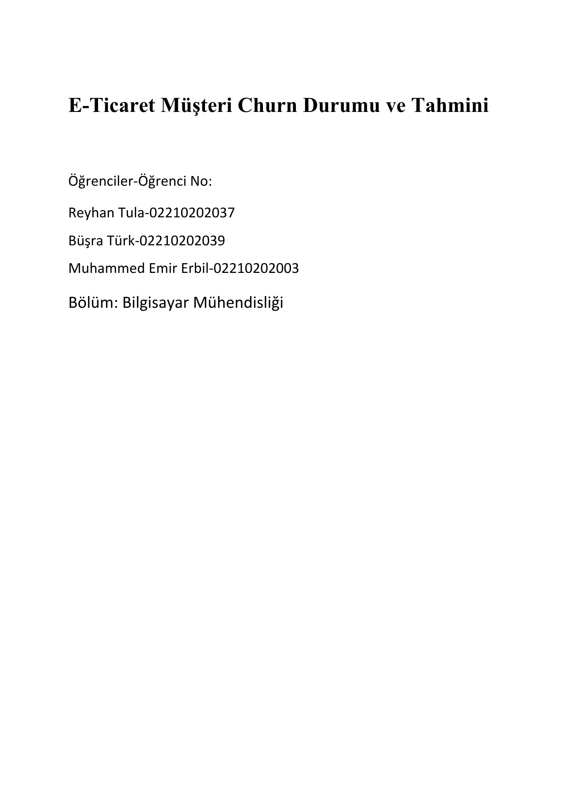
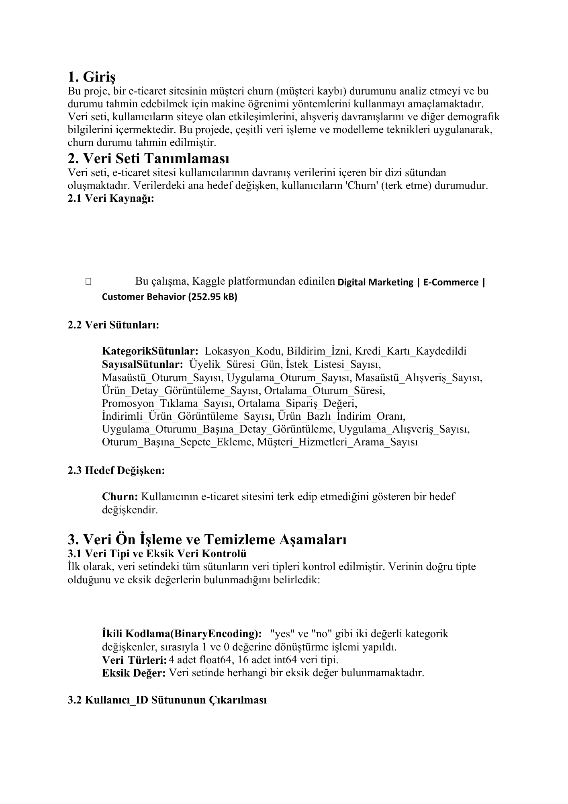
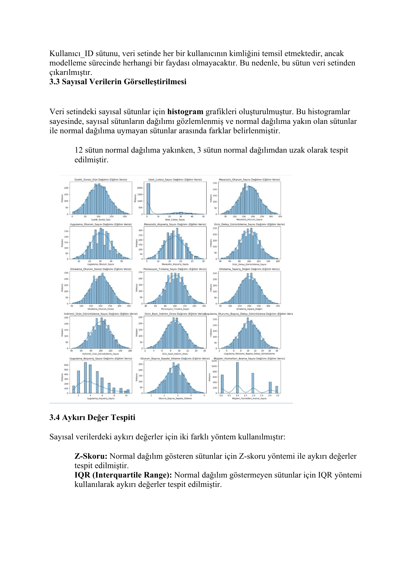
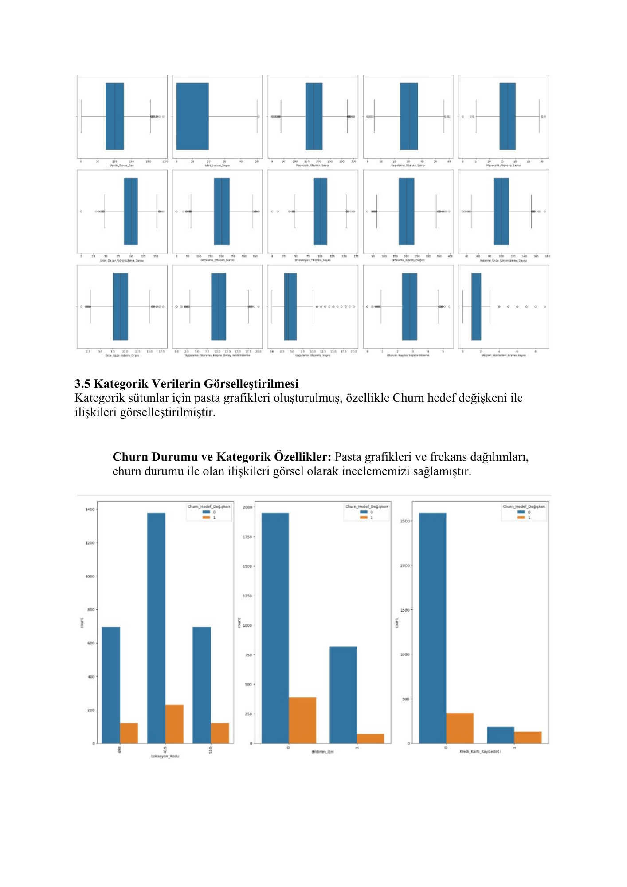
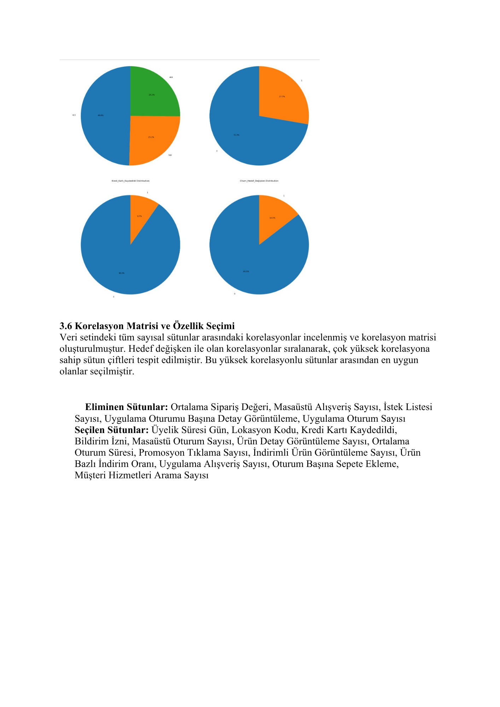
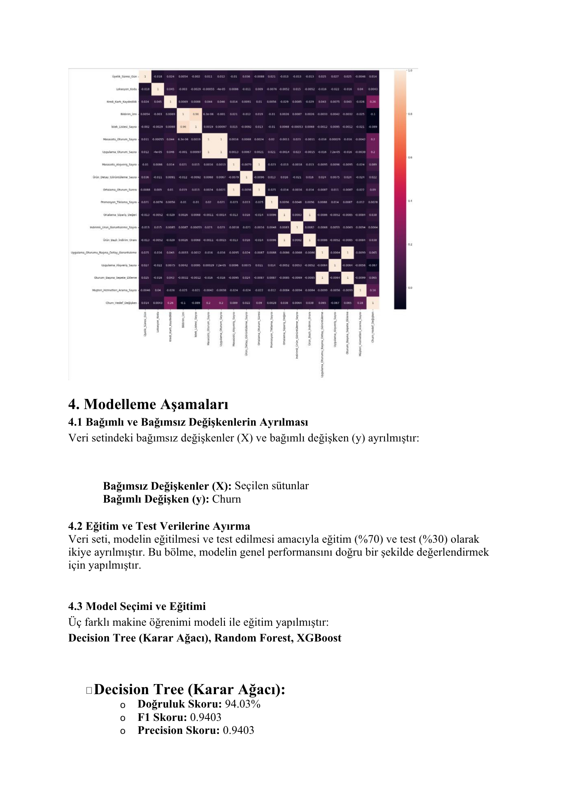
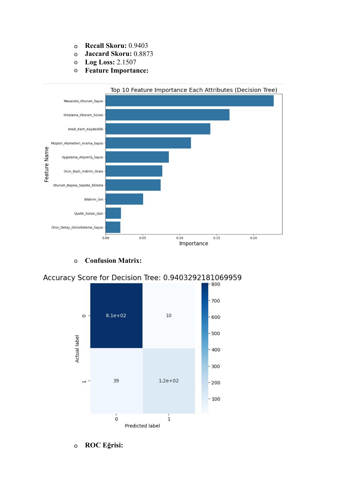
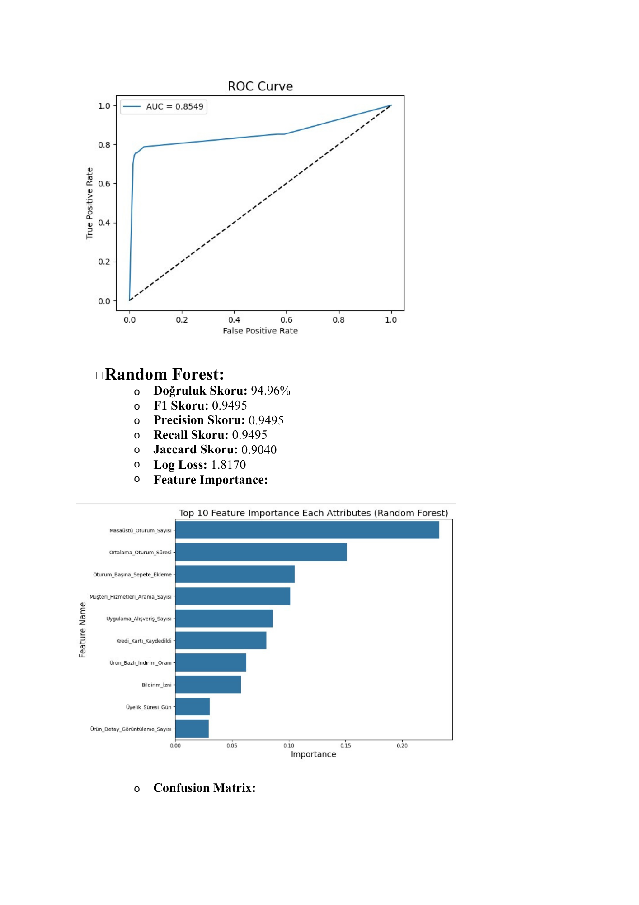
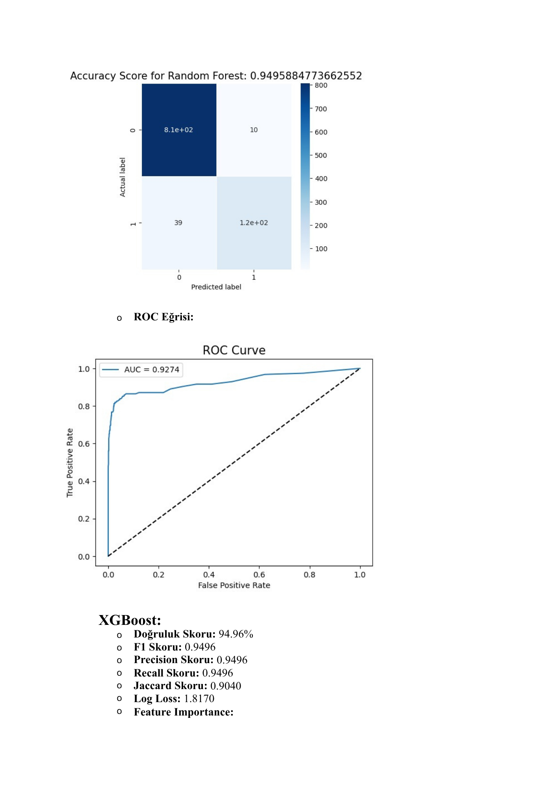
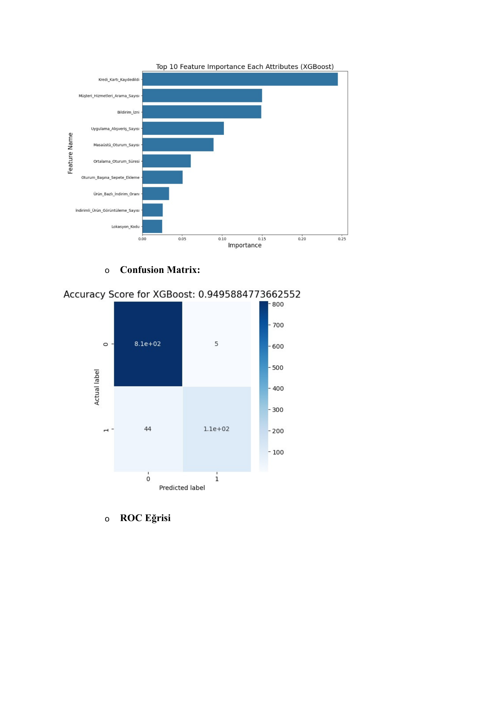
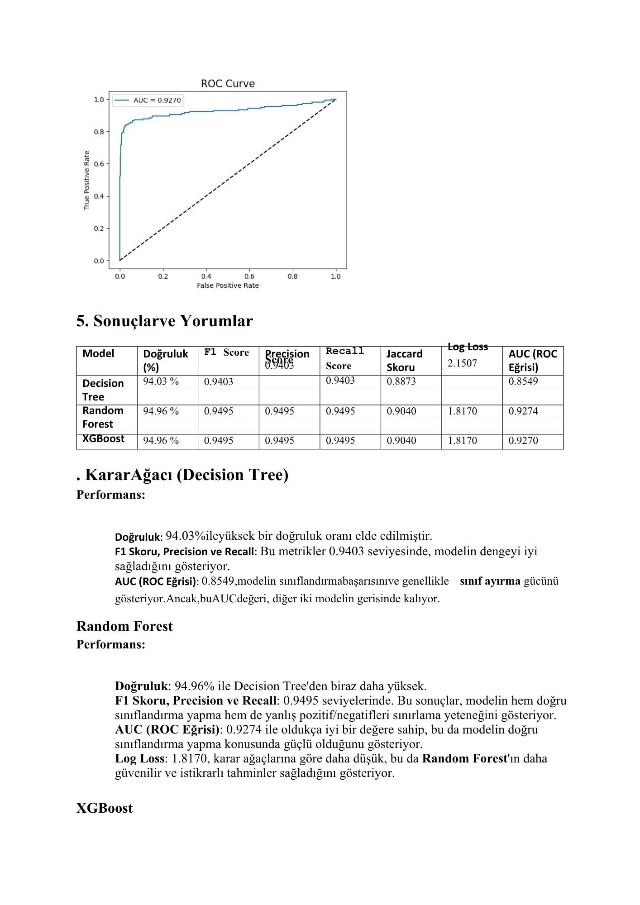
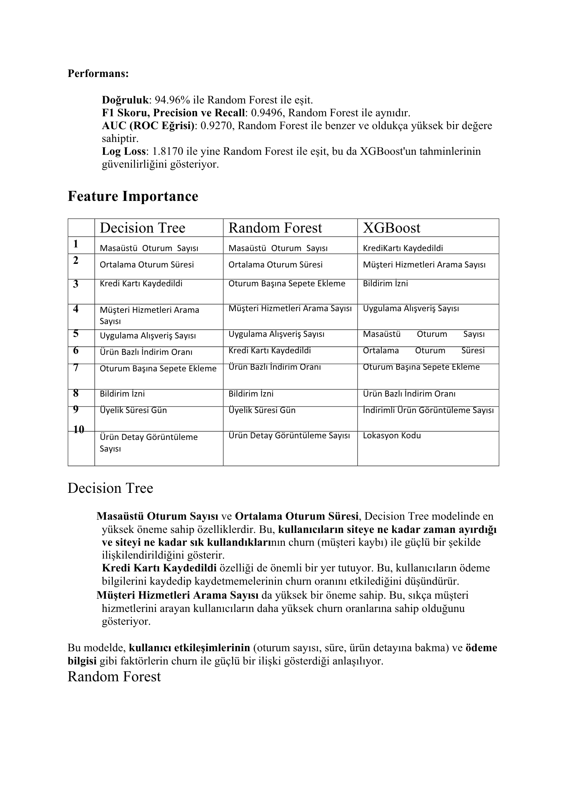
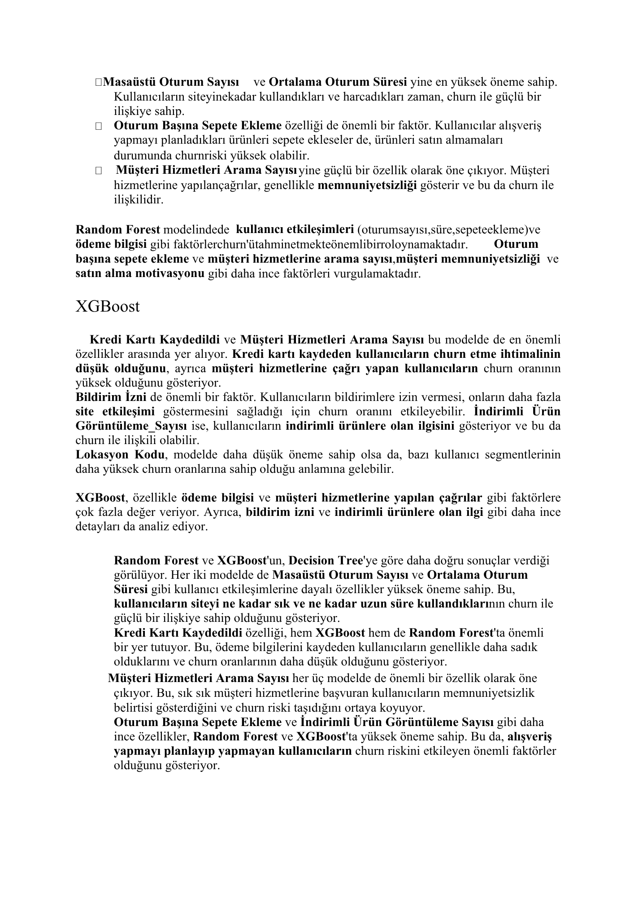

